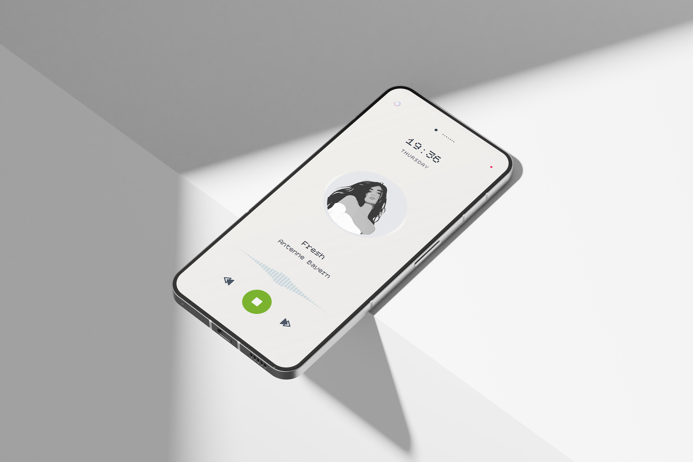

   

   

> [!NOTE]
> Features 🧼      

- Built-in live clock   
- Fast and lightweight   
- Full keyboard control   
- Live streaming 4 radio    
- Real-time audio waveform   
- Cloud & Static Hosting Ready     
- Responsive mobile-friendly design   
- Lightweight – no frameworks required   

> [!TIP]
> Multi-station radio player with Modular Architecture.   

- player.js — Audio logic, controls, UI state   
- wave.js — Independent visualizer engine   
- tracks.json — customize radio stations / covers / wave colours   

> [!TIP]
> Keyboard shortcuts   
  
- Space — Play / Pause   
- ← / → — Track navigation   

#### Tech Stack   
```
Bun | Vite | Tailwind CSS | Vanilla JS   
```